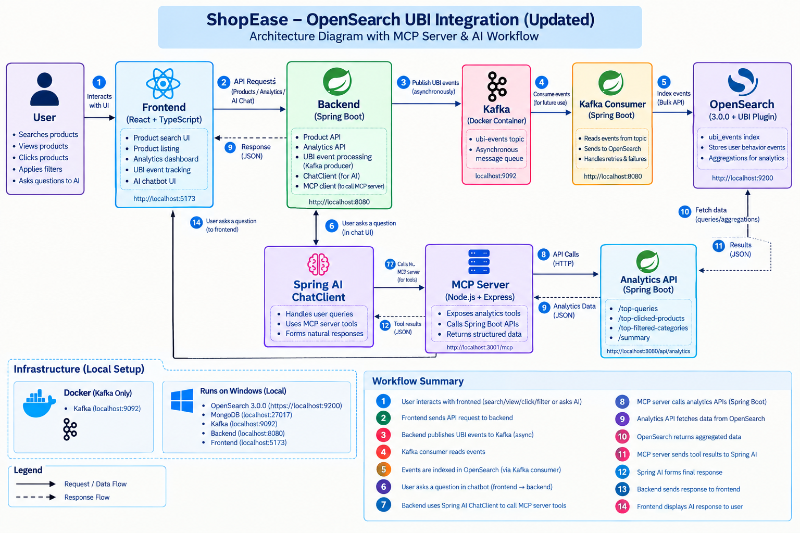

# ShopEase – OpenSearch UBI Integration

A simple React + Spring Boot application that captures user behavior such as page views, searches, and product clicks and integrates these events with OpenSearch User Behavior Insights (UBI).

## Approach

The application follows this flow:

React Frontend → Spring Boot Backend → UBI Validation → Kafka → Kafka Consumer → OpenSearch UBI

- React captures view, search, and click events.
- Events are sent to the Spring Boot backend using Axios.
- Spring Boot validates events against the UBI event schema.
- Valid events are published to the Kafka ubi-events topic.
- Kafka Consumer reads events from the topic and sends them to OpenSearch.
- If OpenSearch is unavailable, the consumer retries the event every 5 seconds.
- Product data is stored in MongoDB and accessed through the Spring Boot Product API.
- The /insights page displays aggregated view, search, and click counts from OpenSearch.



## Features
### User Behavior Tracking
Page view tracking
Product search tracking
Product click tracking
Client ID tracking
Session ID tracking
UBI event schema validation

### Product Search
Product data stored in MongoDB
Search by product name
Search by category
Case-insensitive search
Handles exact product-name searches
No-match handling
Empty search returns all products

### Event Processing
UBI events are validated before publishing
Kafka Producer publishes validated events
Kafka Consumer processes events asynchronously
Events are stored in OpenSearch
Automatic retry when OpenSearch is unavailable

### Analytics
View count
Search count
Click count
Analytics data retrieved using OpenSearch aggregations
Dashboard available at /insights

## Technology Stack
Frontend: React, TypeScript, Material UI
Backend: Spring Boot, Java
Database: MongoDB
Message Broker: Apache Kafka
Kafka Runtime: Docker
Search & Analytics: OpenSearch 3.0.0
Analytics Plugin: OpenSearch UBI Plugin
HTTP Client: Axios
Build Tool: Maven
Containerization: Docker

## How to Run

### 1. Start OpenSearch

```cmd
cd /d "C:\path\to\opensearch-3.0.0-windows-x64\opensearch-3.0.0"
opensearch-windows-install.bat
```

Initialize UBI during the first setup:

```powershell
curl.exe -k -u "admin:<password>" -X POST "https://localhost:9200/_plugins/ubi/initialize"
```
### 2. Start MongoDB

Make sure MongoDB is running locally on:

mongodb://localhost:27017

The application uses the shopease database.

### 3. Start Kafka

Kafka runs inside a Docker container.

From the project root:

docker compose up -d

Check the container:

docker compose ps

Create the ubi-events topic if it does not already exist:

docker compose exec kafka /opt/kafka/bin/kafka-topics.sh --create --topic ubi-events --bootstrap-server localhost:9092 --partitions 1 --replication-factor 1

Kafka runs on:

localhost:9092

### 4. Start Backend
cd ubi-backend
mvnw.cmd spring-boot:run

Backend:

http://localhost:8080

The backend connects to:

MongoDB → localhost:27017
Kafka → localhost:9092
OpenSearch → https://localhost:9200

### 5. Start Frontend
cd shopease
npm install
npm run dev

Frontend:

http://localhost:5173

Open the website and perform searches and product clicks to generate UBI events.

### 6. View Analytics

Open:

http://localhost:5173/insights

The dashboard displays:

Searches
Views
Clicks

## Demo:
https://github.com/user-attachments/assets/fd106c7e-2c06-4cba-bcf0-e76d573d8b62


## Assumptions
- OpenSearch 3.0.0 and the UBI plugin are installed locally.
- OpenSearch runs on https://localhost:9200.
- A PKCS12 truststore containing the OpenSearch CA certificate is configured for the backend.
- MongoDB runs locally on localhost:27017.
- Kafka runs through Docker on localhost:9092.
- The ubi-events Kafka topic is configured with one partition and one replica for the local setup.
- OpenSearch credentials and truststore credentials are configured locally and should not be committed to GitHub.


## References

- [OpenSearch User Behavior Insights](https://github.com/opensearch-project/user-behavior-insights)
- [UBI Project](https://github.com/o19s/ubi)
- [UBI Event Schema](https://o19s.github.io/ubi/schema/latest/event.schema.json)
